```{r xaringan-themer, include=FALSE, warning=FALSE}
library(xaringanthemer)

style_xaringan(
  # Set fonts
  header_font_google = google_font("Libre Baskerville"),
  text_font_google   = google_font("Lato"),
  code_font_google   = google_font("Fira Mono"),
  # Title page
  inverse_background_color = "#43003F",
  inverse_text_color = "white",
  title_slide_text_color =  "white",
  # General
  text_font_size = "30px",
  header_color = "#43003F",
  # Yellow highlight colour
  #text_bold_color = "#FFCA17",
  colors = c(
    red = "#f34213",
    yellow = "#FFCA17",
    purple = "#43003F",
    white = "#FFFFFF"
  ))

```

class: header_background
# Land acknowledgement

The land on which the University of Toronto and Pursue STEM operate is the traditional lands of the .highlight[Anishinaabe], the .highlight[Haudenosaunee], and the .highlight[Mississaugas of the Credit]. With the Dish With One Spoon treaty, these peoples agreed to share and protect this land, and all those who have come here since, both Indigenous and non-Indigenous, are invited into this treaty in a spirit of respect and peace. This land is also, more recently, subject to Treaty 13, a treaty between the Mississaugas and the British Crown.

Today, we are coming together to discuss statistics, a field that has been part of historical and ongoing colonization, oppression, and harm of Indigenous peoples and marginalized communities. Let us remind ourselves of our responsibilities to this land, its original peoples, and to each other and work to be ethical and culturally competent practitioners in our chosen fields.

---
class: inverse, middle, center

# .yellow[“]The best thing about being a <br>.yellow[statistician]<br> is that you get to play in<br> .yellow[everyone's backyard]..yellow[”]

## ~John Tukey

---
class: center
background-image: url("libs/images/pitfall_walk_1.png")
background-size: contain

---
class: center
background-image: url("libs/images/pitfall_walk_2.png")
background-size: contain


---
class: center
background-image: url("libs/images/pitfall_walk_3.png")
background-size: contain


---
class: center
background-image: url("libs/images/pitfall_walk_4.png")
background-size: contain


---
class: center
background-image: url("libs/images/pitfall_walk_5.png")
background-size: contain


---
class: center
background-image: url("libs/images/pitfall_walk_6.png")
background-size: contain


---
class: center
background-image: url("libs/images/pitfall_walk_7.png")
background-size: contain


class: header_background
# Plan for today

.large[
By the end of this session, you will be able to:
- Describe some common __statistical reasoning challenges__ (.liner["__pitfalls__"]). 
- Give __real-world examples__ of the .liner["__monsters__"] created in/through these pitfalls
- Love stats because it is so much fun (and very useful)
]

---
class: inverse, middle

# Slides can be found at:
# [ps-stats-22.netlify.app](https://ps-stats-22.netlify.app/)

---
class: header_background
# Content warning

.large[
One of the stories today will talk briefly about abortion, another discusses the 2016 US election. 

If at any time you feel uncomfortable or would like any support, please message Ethan, Daniela or myself. It is always okay to take a step away if you need it.
]

---
class: inverse
# Structure of each pitfall
```{r, echo=FALSE, out.width="100%"}
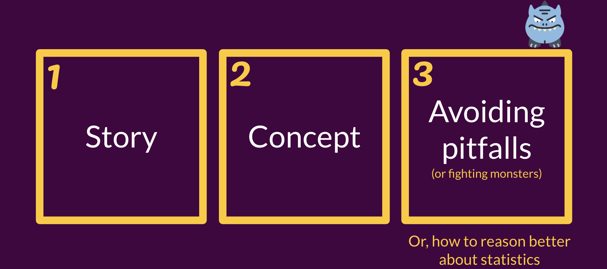
```


---
class: inverse, middle
background-image: url("libs/images/pill-mon.png")
background-position: bottom center
background-size: 248px 156px

# Take a chill pill


---
background-image: url("libs/images/story.png")
background-position: top left
background-size: 70px 70px
layout: true

---
class: middle

.pull-left.large[
In October 1995 the UK Committee on Safety of Medicines announced people taking 3rd generation oral contraceptive (OC) pills had double the risk of blood clots of 2nd generation OCs.]
.pull-right[

```{r, echo=FALSE, out.width = "70%"}
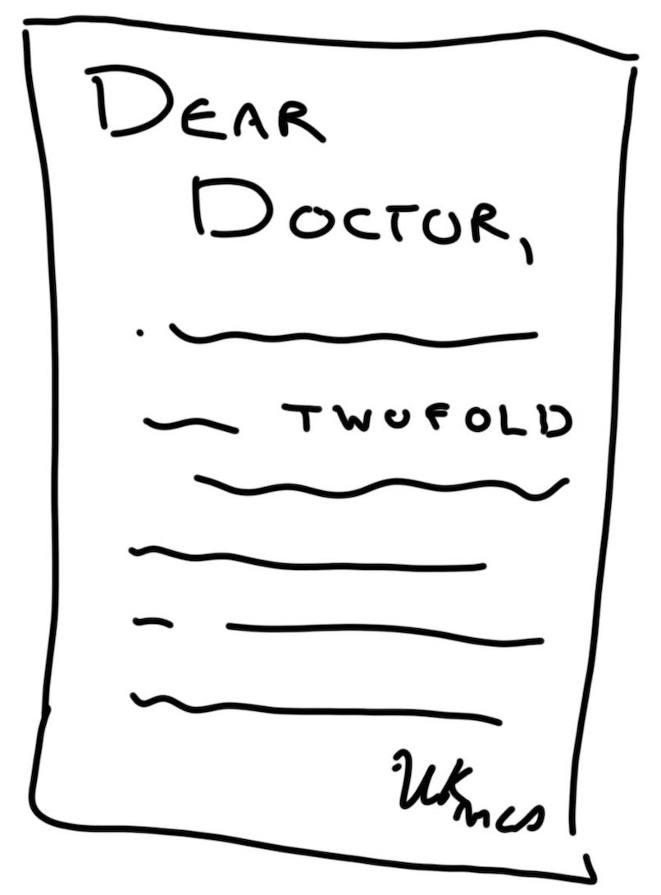
```
]

.footnote.purple[_Pitfall 1_]

---
class: middle

.pull-left[
<br>
<br>
.mega.purple.bg-yellow[That’s a 100% increase]
]

.pull-right[

```{r, echo=FALSE, out.width = "70%"}

```
]


.footnote.purple[_Pitfall 1_]

---
class: middle, centre

```{r, echo=FALSE, out.width = "90%", align='center'}
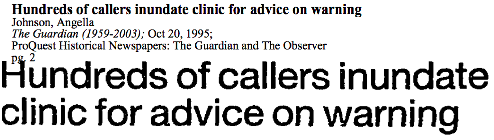
```


.footnote.purple[_Pitfall 1_]

---
class: middle

.pull-left[
<br>
<br>
.mega.purple[OCs were _already_ __known__ to increase risk of blood clots.]
]

.pull-right[

```{r, echo=FALSE, out.width = "70%"}
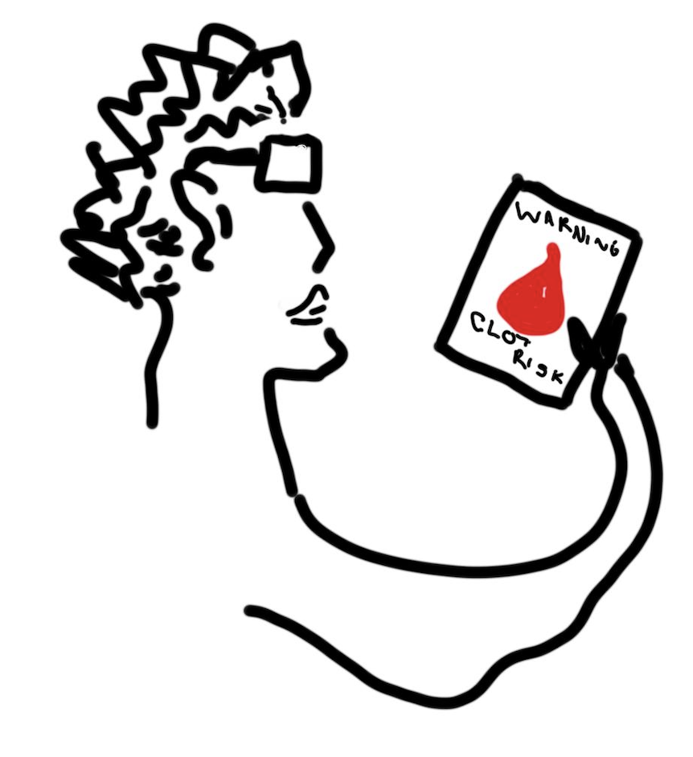
```
]


.footnote.purple[_Pitfall 1_]

---
class: inverse, middle

.mega[“For the vast majority of women, the pill is a .yellow[safe and highly effective] form of contraception. … .yellow[No-one need stop taking the pill] before obtaining medical advice.”]

~ Advice from UK Committee on Safety of Medicines in the same message


.footnote.purple[_Pitfall 1_]

---
class: center, middle

```{r, echo=FALSE, out.width = "100%"}
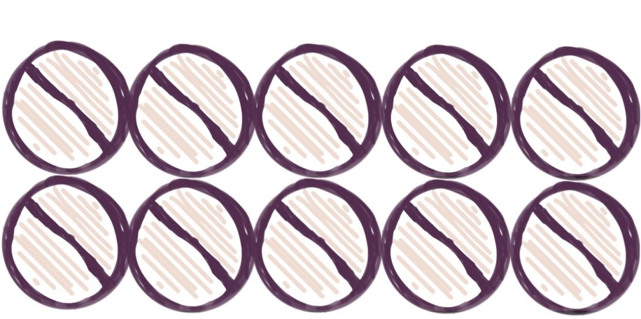
```


.footnote.purple[_Pitfall 1_]

---
class: center, middle

```{r, echo=FALSE, out.width = "100%"}
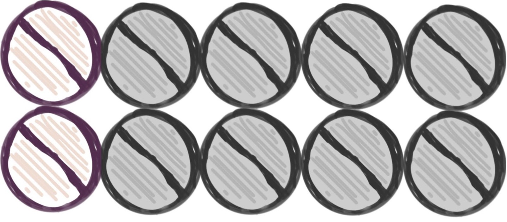
```


.footnote.purple[_Pitfall 1_]

---
class: center, middle

```{r, echo=FALSE, out.width = "50%"}
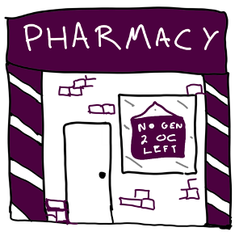
```


.footnote.purple[_Pitfall 1_]

---
class: center, middle

.bg-yellow[13,500] more abortions

```{r, echo=FALSE, out.width = "60%"}
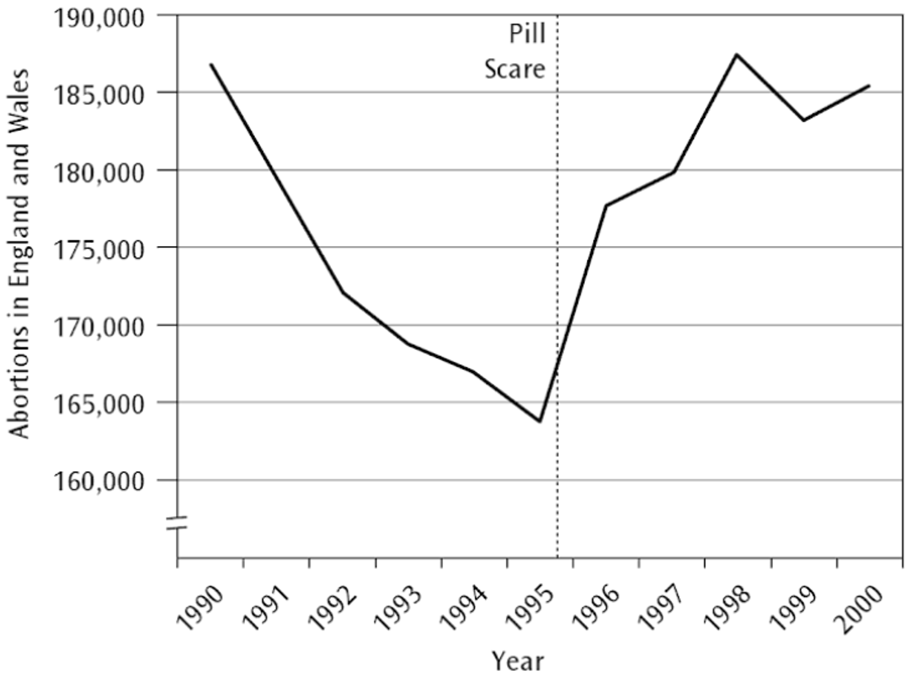
```


.footnote.purple[_Pitfall 1_]

---
class: middle, center

.pull-left[
<br>
<br>
.mega.purple[An estimated .bg-yellow[800] additional conceptions among .bg-yellow[girls under 16]]
]

.pull-right[

```{r, echo=FALSE, out.width = "70%"}
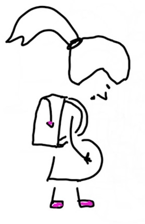
```
]


.footnote.purple[_Pitfall 1_]

---
class: middle, center

.pull-left[
<br>
<br>
.mega.purple[.bg-yellow[£4 to 6 million] spend on abortions by the National Health Service (NHS)]
]

.pull-right[

```{r, echo=FALSE, out.width = "70%"}
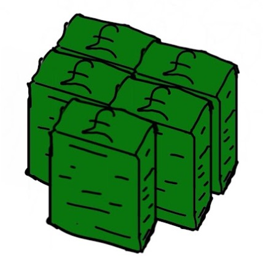
```
]


.footnote.purple[_Pitfall 1_]


---
background-image: url("libs/images/concept.png")
background-position: top left
background-size: 70px 70px
layout: true

.footnote.purple[_Pitfall 1_]
---
class: inverse, center, middle

# What is risk?

.footnote[_Pitfall 1_]

---
class: inverse, middle

# Two types:
.center.mega[ .highlight.purple[Absolute] risk and .highlight.purple[relative] risk]

.footnote[_Pitfall 1_]

---
class: inverse, middle

.mega[Absolute risk is a .yellow[probability].]

.large[
The absolute risk of getting a blood clot for people taking the 3rd gen OC could be calculated as:

.center[
Total number of people taking the 3rd gen OC
<hr color = yellow>
Number of people taking the 3rd gen OC that get a blood clot]
]

.footnote[_Pitfall 1_]

---
class: middle, center

.left-column[

```{r, echo=FALSE, out.width = "90%"}
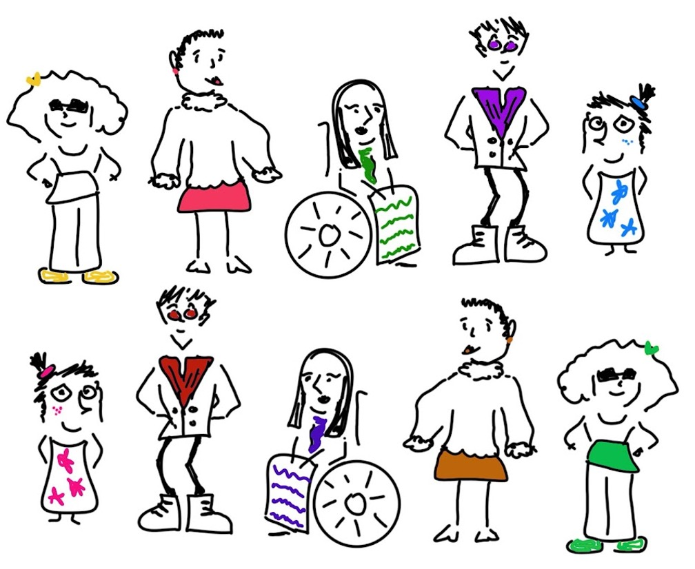
```
]

.right-column[.mega.purple[
<br>
10]]

---
class: middle, center

.left-column[

```{r, echo=FALSE, out.width = "90%"}
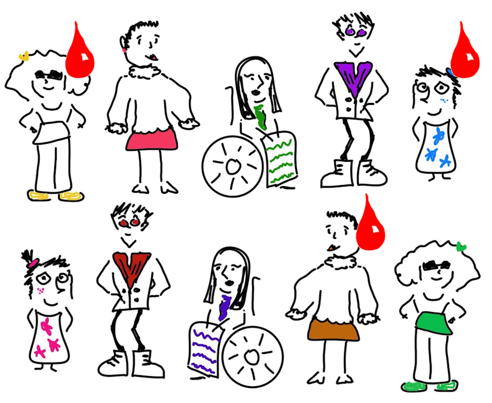
```
]

.right-column[.mega.red[
<br>
3]]


---
class: middle, center

.left-column[

```{r, echo=FALSE, out.width = "90%"}
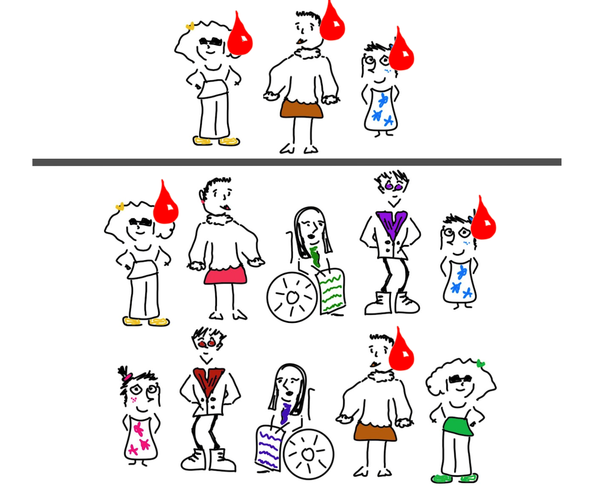
```
]

.right-column[.mega.red[
<br>
3]

.mega.purple[10]
]


---
class: center, middle

.mega[
$$\frac{3}{10} = 30\%$$

]

---
class: inverse, middle, center

# What does DOUBLE the risk mean?

---
class: inverse, middle, center

# When we talk about .yellow[double the risk], or .yellow[2x the risk] or a .yellow[twofold increase in risk]...

--

.large[We’re talking about .highlight[relative risk].]

--

.large[We are .yellow[__comparing__] two .highlight[absolute risks].]

---
class: center, middle


|           | Absolute Risk 1 | Absolute Risk 2 | Relative Risk |
|-----------|-----------------|-----------------|---------------|
| Example A | 30%             | 60%             | 2             |


---
class: center, middle

|           | Absolute Risk 1 | Absolute Risk 2 | Relative Risk |
|-----------|-----------------|-----------------|---------------|
| Example A | 30%             | 60%             | 2             |
| Example B | 3%              | 6%              | 2             |


---
class: center, middle

|           | Absolute Risk 1 | Absolute Risk 2 | Relative Risk |
|-----------|-----------------|-----------------|---------------|
| Example A | 30%             | 60%             | 2             |
| Example B | 3%              | 6%              | 2             |
| Example C | 0.3%            | 0.6%            | 2             |


---
background-image: url("libs/images/pitfall.png")
background-position: top left
background-size: 70px 70px
layout: true

.footnote.purple[_Pitfall 1_]
---
class: inverse, center, middle

.large[When interpreting or reporting risks make sure you think about both .yellow[absolute] and .yellow[relative] risk.]

.footnote[_Pitfall 1_]

--

.large[Relative risks can sound big and scary but not mean much at all.]

--

.large[(A small number multiplied by a big number can still be quite a small number.)]

--

.large[Then again, a small increase or decrease in the relative risk of something that affects a lot of people might have very big social/financial implications.]

---
background-image: url("libs/images/bacon.jpg")
background-size: contain

---
class: inverse, center, middle

.footnote[_Pitfall 1_]

.large[It is estimated that about .highlight.purple[1 in 14 Canadian men] will develop colorectal cancer during their lifetime and 1 in 34 will die from it.]

--

.large[≈ 7%]

--

.large[It is estimated that about .highlight.purple[1 in 18 Canadian women] will develop colorectal cancer during their lifetime and 1 in 40 will die from it.
]

--

.large[≈ 6%]


.small[~ Colorectal cancer statistics. Cancer society of Canada. Retrieved from: https://cancer.ca/en/cancer-information/cancer-types/colorectal/statistics?_ga=2.53517867.286138816.1645884769-170759981.1645884769]

---
class: inverse, center, middle

.footnote[_Pitfall 1_]

# 7% increased by 18% ≈ 8%

1 percentage point increase

---
class: header_background
# Activity time

- We'll put you in breakout rooms.  
- Go to: https://forms.gle/gSD39vN7g22Bsvrb7 (ideally one person can share their screen, but okay if not).  
- Now YOU are the doctor, talk through what advice you'd give a patient that comes to you now with questions and concerns about bacon consumption.

---
class: inverse, center, middle

# Report back

.footnote[_Pitfall 1_]

---
class: inverse, middle
background-image: url("libs/images/baseline-mon.png")
background-position: bottom center
background-size: 203px 203px

# With you till the end of the baseline

---
background-image: url("libs/images/story.png")
background-position: top left
background-size: 70px 70px
layout: true

.footnote.purple[_Pitfall 2_]

---
class: center, middle


```{r, echo=FALSE, out.width = "90%"}
knitr::include_graphics("https://64.media.tumblr.com/3dd6bc15ed18010e9b0937613557dd9c/tumblr_p34e7cuiyD1wu7qxxo1_500.gif")
```

---
class: center, middle


```{r, echo=FALSE, out.width = "60%"}
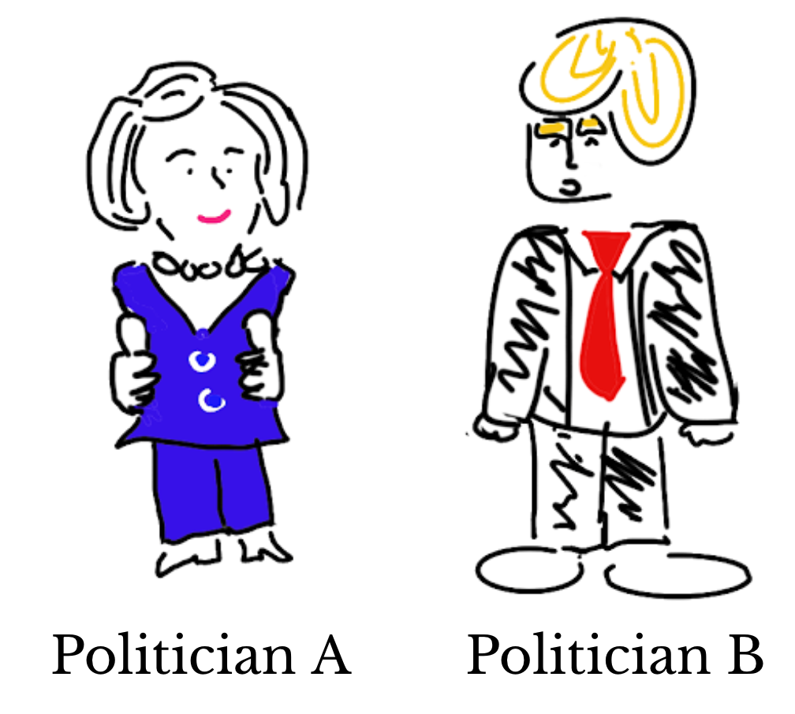
```

---
class: center, middle

# Go to: https://forms.gle/F3ARdBXDgit2qTnUA 

```{r, echo=FALSE, out.width = "60%"}
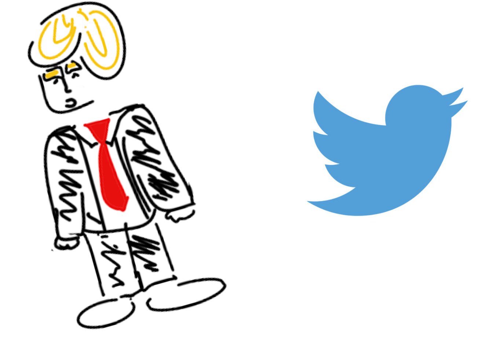
```


---
class: ceneter, middle

```{r, echo=FALSE, out.width = "40%", fig.align='center'}
knitr::include_graphics("libs/images/polls-1.png")
```

---
class: ceneter, middle

```{r, echo=FALSE, out.width = "50%", fig.align='center'}
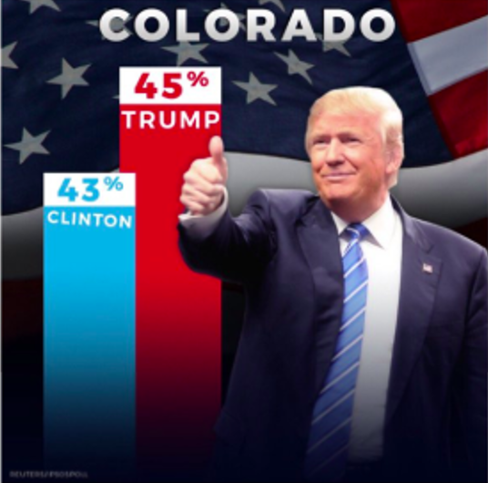
```

---
class: ceneter, middle

```{r, echo=FALSE, out.width = "90%"}
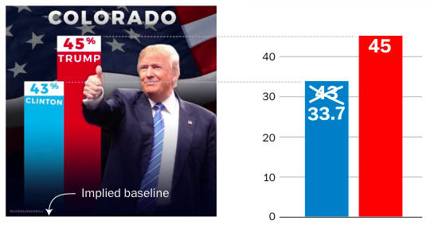
```

.small[https://www.washingtonpost.com/graphics/politics/2016-election/trump-charts/]

---
background-image: url("libs/images/concept.png")
background-position: top left
background-size: 70px 70px
layout: true

.footnote.purple[_Pitfall 2_]

---

<br>

```{r, echo=FALSE, out.width = "90%"}
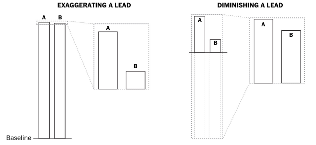
```

.small[https://www.washingtonpost.com/graphics/politics/2016-election/trump-charts/]


---

```{r, echo=FALSE, out.width = "90%"}
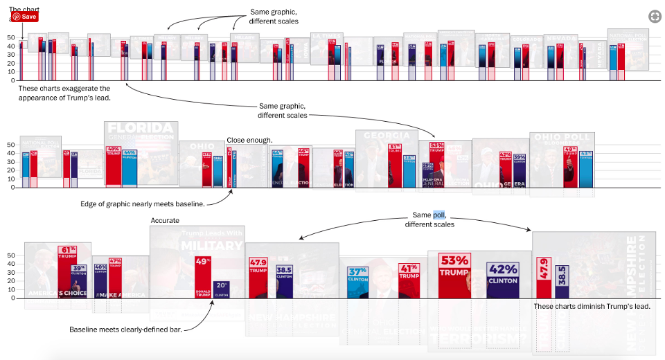
```

.small[https://www.washingtonpost.com/graphics/politics/2016-election/trump-charts/]

---
background-image: url("libs/images/pitfall.png")
background-position: top left
background-size: 70px 70px
layout: true

.footnote.purple[_Pitfall 2_]

---
class: inverse, middle, center

.large[When making or interpreting bar charts, make sure the .yellow[baseline] is visible and .yellow[represents zero] on your scale.]

--

.mega["For bar charts, a zero baseline is the difference between .yellow[data visualization] and .yellow[data spin].”]

~ John Muyskens, .small[www.washingtonpost.com/graphics/politics/2016-election/trump-charts]

---
class: header_background
# Activity time

- I'll put you in breakout rooms. 
- No link for this activity, but ideally someone has a pen/paper handy or a tablet/phone that they can draw on.
- Choose a more modern concern than the 2016 election. Ideally something that matters to YOU. Imagine you were a trying to do some _data spin_. 
  - Decide on some statistics to compare INAPPROPRIATELY (you're aiming for spin, not truth!).
  - Sketch your bad graph.
  - Prepare to explain what the goal of your data spin is back to the group and talk about how you'd achieve that with your chart.
  
.small[Note: You may not have factual numbers available and/or they take too much time to find. Don't worry too much about that, __the point is to sketch out  how you'd apply this concept.__]

---
class: inverse, middle, center

# Report back

---
layout: true

---
class: inverse, middle, center

# Thank you!

---
class: header_background

# Acknowledgements

- Monsters designed by Smashicons from Flaticon  
- Hiker designed by monkik from Flaticon  
- Inspiration from Anna Fergusson, Stephanie Budgett and the Stats 20x team
